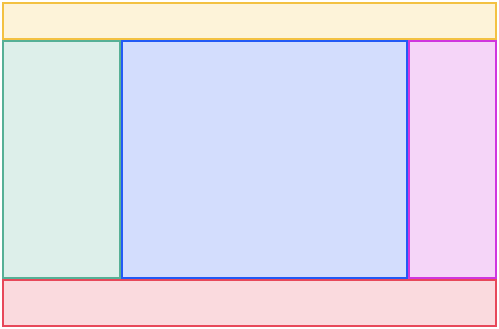

# Holy Grail

One of the main use cases for CSS Grid is to create full-page layouts. 

Let's create the most famous full-page layout, __"Holy Grail"__:

## Requirements

* The layout should span the entire page.
* A header should use a `<header>` tag, and be 4rem tall.
* The sidebar should use a `<nav>` tag, and be 200px wide.
* The main content area should use `<main>`, and fill the _available space._
* The ad unit should use an `<aside>` tag, and be 150px wide.
* The footer should use a `<footer>` tag, and be 5rem tall.
