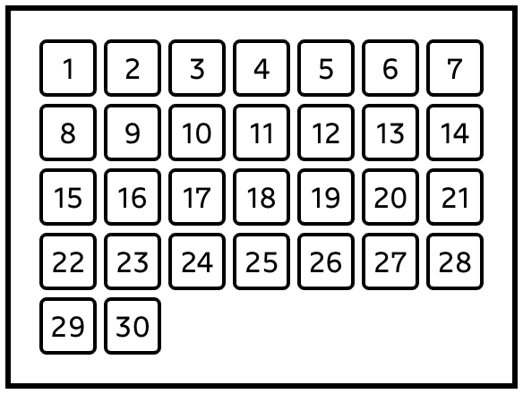

# Calendar 

Let's create a mini calendar:

* The dark outer border is part of the challenge!
It should wrap neatly around the calendar;
* To keep things simple, we're assuming that the 1st day of the month is Sunday; 
* Each day on the calendar should be a square, sized at 2rem x 2rem;
* We're using react for this one, to make it easier to generate 30 child elements we need. But you shouldn't need to tweak any of JSX, only the CSS.